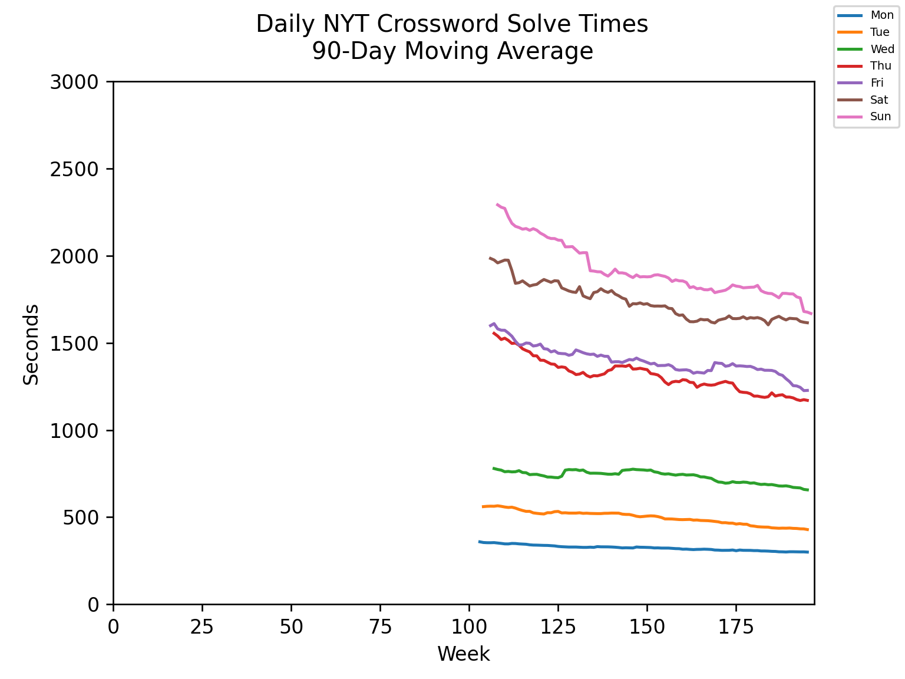

# 🍳 Griddle

A suite of Python scripts to fetch and analyse your NYT Crossword data.

## Dependencies

Be sure to run `pip3 install -r requirements.txt` before proceeding.

## Commands

### fetch.py

Writes the solution time for a given day if the user obtained a gold star.

Usage:

```sh
$ python3 fetch.py <uid> <sidny> [<year> <month> <day>]
```

`<uid>` and `<sidny>` can be obtained from your NYT Games login session. If
`<year> <month> <day>` are not specified, the information for the latest puzzle
is produced.

The output format can be saved as a CSV file.

### merge.py

Merges the output of `fetch.py` into an existing data file of solution times.
Repeatedly calling `fetch.py ... | merge.py <file>` will produce a CSV file of
historical data.

### analyse.py

Analyses a CSV file of historical data to produce:

 * List of streaks
 * Per-weekday tables of best and recent solve times
 * Per-weekday simple moving averages
 * PNGs of historical trends of per-weekday simple moving averages

Usage:

```sh
$ < data.csv python3 analyse.py [<sma_window> ...]
```

`<sma_window>` is one or more moving window sizes for the simple moving average
calculation.



